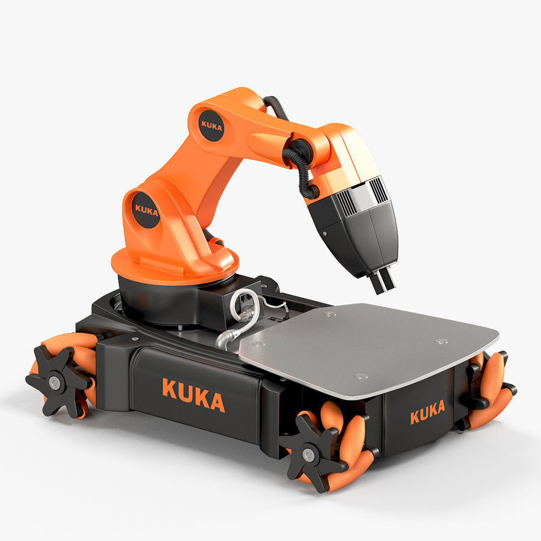
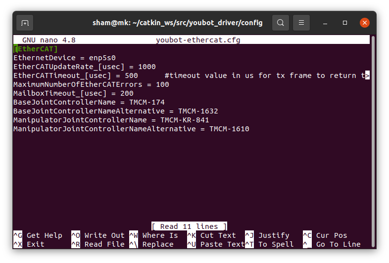

# Установка программного обеспечения для мобильной платформы KUKA youBot

В данном документе представлена инструкция по установке и настройке программного обеспечения для платформы KUKA youBot.



## Подготовка рабочего окружения

Для работы вам потребуется компьютер под управлением операционной системой Ubuntu 20.04 и установленная операционная система для роботов ROS Kinetic Kame. Данная инструкция подойдет и к более старым версиям.

[Инструкция по установке Ubuntu 16.04](https://losst.ru/ustanovka-ubuntu-20-04)

[Инструкция по установке ROS](http://wiki.ros.org/noetic/Installation/Ubuntu)

## Полезные ссылки

[Кинематика и 3D модель youbot](http://www.youbot-store.com/developers/kuka-youbot-kinematics-dynamics-and-3d-model-81)

[Репозитории youbot](https://github.com/youbot)

[Введение в ROS](https://github.com/shamoleg/course)

sudo setcap cap_net_raw+ep devel/lib/youbot_control/youbot_control

## Установка

Создайте рабочую область ROS или пропустите данный пункт если рабочая область существует:

```console
mkdir -p ~/catkin_ws/src
cd ~/catkin_ws/src/
catkin_init_workspace
cd ~/catkin_ws
catkin_make
```

Для использования созданного окружения добавьте выполнение команды в файл .bashrc

```console
echo "source ~/catkin_ws/devel/setup.bash" >> ~/.bashrc
source ~/.bashrc
```

Установите git:

```console
sudo apt-get install git
```

Клонируйте данный репозиторий в папку рабочей области:

```console
cd ~/catkin_ws/src
git clone https://github.com/shamoleg/youbot.git
```

Клонируйте данный репозитории субмодулей:

```console
cd ~/catkin_ws/src/youbot
git submodule init
git submodule update
```

Скачайте необходимые зависимости и соберите клонированные пакеты:

```console
cd ~/catkin_ws
rosdep install --from-paths src --ignore-src -r -y
catkin_make
```

Перейдите в директорию с собранным youbot_driver_interface и разрешите исполняемым файлам взаимодействовать с EtherCAT:

```console
cd ~/catkin_ws/devel/lib/youbot_driver_interface/
sudo setcap cap_net_raw+ep youbot_driver_interface
sudo setcap cap_net_raw+ep youbot_2nd_arm_test
sudo setcap cap_net_raw+ep youbot_arm_test
```

Установите утилиту ifconfig:

```console
sudo apt-get install net-tools
```

Узнайте название Ethernet интерфейса запустив утилиту:

```console
ifconfig
```

В приведенном на картинке примере названием является enp5s0:


Перейдите в директорию конфигурационных файлов youbot_driver/config:

```console
roscd youbot_driver/config 
```

Измените в название EthernetDevice на название Ethernet интерфейса компьютера отредактировав файл youbot-ethercat.cfg консольным текстовым редактором nano:

```console
nano youbot-ethercat.cfg
```

Конфигурационный файл должен выглядеть как на приведенной картинке ниже




Персональный компьютер готов к управлению мобильной платформой youbot

## Запуск мобильной платформы

Для запуска платформы последовательно выполните:
- Подключите блок питания к платформе
- Зажмите черную кнопку на верхней панели до момента когда загорится дисплей
- Зажмите черную кнопку и отпустите когда на экране загориться надпись "Motor on"
- Однократно нажмите горящую красным кнопку расположенную на манипуляторе
- Соедините персональный компьютер и мобильную платформу патч кордом (ethernet кабелем)

Мобильная платформа включена и готова к работе.

Обновите кэш разделяймых библиотек:
```console
ldconfig /opt/ros/noetic/lib/
```

Запустите yзел управления на персональном компьютере:
```console
roslaunch youbot_driver_interface youbot_driver_interface.launch
```

Запустите тест в новом окне терминала:
```console
rosrun youbot_driver_interface youbot_arm_test 
```

Запустите управление передвижением:
```console
rosrun youbot_driver_interface youbot_keyboard_teleop.py
```

Для остановки работы узла в выбранном окне терминала нажмите сочетание клавиш  `Ctrl + C`

Для выключения мобильной платформы зажмите черную кнопку и отпустите когда на экране загориться надпись "Switch off", экран должен погаснуть.
